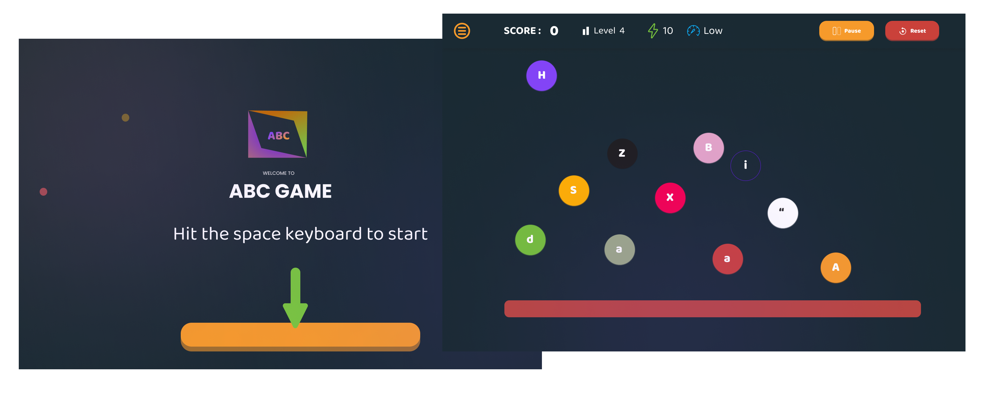

# ABC-Game-Web-Application



## Welcome 👋🎉

Full crash functional typing game called ABC game who aims at helping people to enhance their typing skills by playing - poping letters on the scren makes fun.

**ABC Game** is a fun and interactive typing game designed to help users enhance their typing skills. Letters pop up at different speeds, and the goal is to type them correctly as fast as possible. The game becomes more challenging as the speed increases.

## Notice

Everything is code into `HTML`, `CSS` and `Vanila JavaScript`

## Features 🥲

- Dynamic Typing Challenges: Letters appear on the screen at varying speeds to challenge users' typing abilities.

- Scoring System: Points are awarded for correctly typed letters, with bonuses for speed and accuracy.

- Difficulty Levels: The game offers different difficulty levels, allowing users to start easy and progress to more challenging levels as they improve.

- Customizable Settings: Users can customize the game's settings, including the speed of letters and the types of letters (e.g., uppercase, lowercase, symbols).

- All bunch of colors changing at everything level and feedback at each level so that the user knows when it has reach a specific level

- All of that the design is perfectly crafted user-friendly so that the user won't struggle to

## Getting Started 😎

### Prerequisites

Before your begin make sure you have these following prerequisites

- A [GitHub](https://github.com/) account
- A better understand of `HTML`, `CSS` and `JavaScript`
- [Git](https://git-scm.com/downloads) for cloning the project
- Annddd let's give it a go

## Installation 👩‍🌾

1. Clone the repository

```bash
git clone https://github.com/PrinceGuruCode237/ABC-Game-Web-Application.git

```

2. Navigate to the project directory

```bash
cd ABC-Game-Web-Application.git
```

3. Look at the files structures and the current code

## How to Play ? 🎮

1. Launch the game by opening it in your browser.
2. Letters will start popping up on the screen.
3. Type the letters you see on the screen as quickly and accurately as possible before they reach the bar which represent the ground.
4. Your score will increase with each correct letter and decrease if you type a letter which is not on the screen. Try to beat your high score!

## Contribution 👭

We welcome contributions from the community! Here's how you can help:

1. Fork the repository: Click the "Fork" button at the top of this page to create a copy of the repository under your GitHub account.

2. Clone your fork: Use the following command to clone your forked repository

```bash

git clone https://github.com/yourusername/ABC-Game-Web-Application.git

```

3. Create a branch: Create a new branch for your feature or bugfix.

```bash
git checkout -b my-new-feature

```

4. Make your changes: code your features or fix and commit your changes

```bash

git commit -m "Add my new feature"
```

5. Push to your branch: push your changes to your forked repository

```bash

git push -m origin my-new-feature
```

6. Submit a pull request: Go to the original repository and submit a pull request

## Feedback and Support 🫂

If you encounter any issues or have suggestions for improvements, please feel free to open an issue on the GitHub repository. We appreciate all feedback and will do our best to address any problems or implement enhancements.
